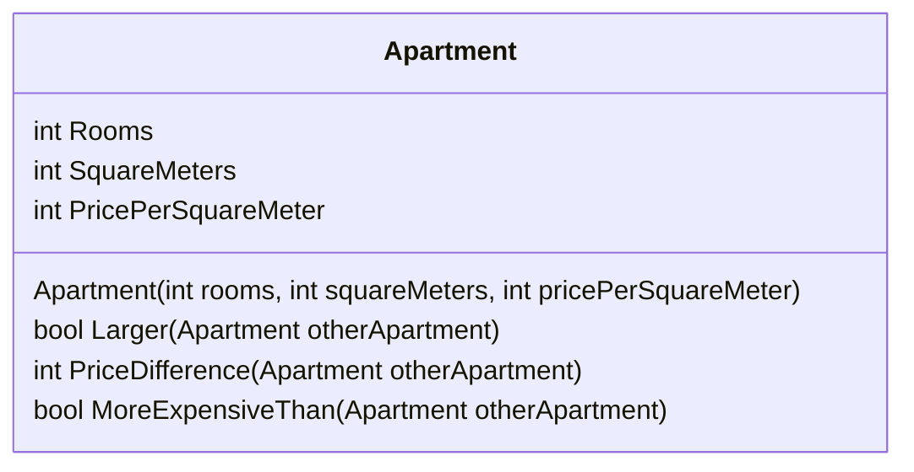

# Appartementvergelijking

We maken een systeem van een woningservice, waarin de apartementen die het te koop heeft stan met objecten van de volgende klasse opslaat


Maak deze klasse in het project, en geef deze klasse een constructor die alle 3 de velden invult, zoals in het klassediagram hierboven is aangegeven


## Groter

Implementeer de methode `public bool Larger(Apartment otherApartment)` die `true` retourneert als het `Apartment`-object waarvoor de methode wordt aangeroepen (`this`) groter is dan het appartement-object dat als parameter wordt meegegeven (`otherApartment`).

Voorbeeld van gebruik:

```csharp
Apartment studioManhattan = new Apartment(1, 16, 5500);
Apartment twoRoomsBrooklyn = new Apartment(2, 38, 4200);
Apartment fourAndKitchenBronx = new Apartment(3, 78, 2500);

Console.WriteLine(studioManhattan.Larger(twoRoomsBrooklyn));       // false
Console.WriteLine(fourAndKitchenBronx.Larger(twoRoomsBrooklyn));   // true
```

## Prijsverschil

Implementeer de methode `public int PriceDifference(Apartment otherApartment)` die de absolute waarde retourneert van het prijsverschil tussen het `Apartment`-object waarvoor de methode wordt aangeroepen (`this`) en het appartement-object dat als parameter wordt meegegeven (`otherApartment`). De prijs van een appartement is `squareMeters * pricePerSquareMeter`.

Absolute waarde betekent hier dat het verschil nooit negatief is, als het negatief is, wordt 't positief gemaakt

Voorbeeld van gebruik:

```csharp
Apartment studioManhattan = new Apartment(1, 16, 5500);
Apartment twoRoomsBrooklyn = new Apartment(2, 38, 4200);
Apartment fourAndKitchenBronx = new Apartment(3, 78, 2500);

Console.WriteLine(studioManhattan.PriceDifference(twoRoomsBrooklyn));        // 71600
Console.WriteLine(fourAndKitchenBronx.PriceDifference(twoRoomsBrooklyn));    // 35400
```

## Duurder dan

Implementeer de methode `public bool MoreExpensiveThan(Apartment otherApartment)` die `true` retourneert als het `Apartment`-object waarvoor de methode wordt aangeroepen (`this`) een hogere prijs heeft dan het appartement-object dat als parameter wordt meegegeven (`otherApartment`).

Voorbeeld van gebruik:

```csharp
Apartment studioManhattan = new Apartment(1, 16, 5500);
Apartment twoRoomsBrooklyn = new Apartment(2, 38, 4200);
Apartment fourAndKitchenBronx = new Apartment(3, 78, 2500);

Console.WriteLine(studioManhattan.MoreExpensiveThan(twoRoomsBrooklyn));       // false
Console.WriteLine(fourAndKitchenBronx.MoreExpensiveThan(twoRoomsBrooklyn));   // true
```


De stukken voorbeeldcode staan al in het programma gedefinieerd, deze kun je aan- of uitzetten met commentaar