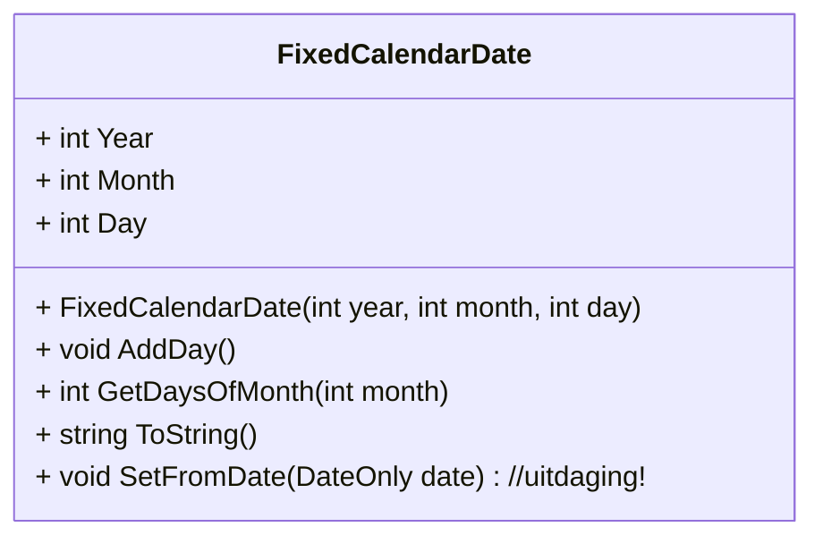

# Fixed Calendar

De meeste landen maken gebruik van de [Gregoriaanse Kalender](https://nl.wikipedia.org/wiki/Gregoriaanse_kalender), waarbij we 12 maanden hebben, die 28, 29, 30 of 31 dagen per maand hebben. Deze kalender is gestandaardiseerd, maar het is natuurlijk wel apart dat het aantal dagen van de maand zo uiteenloopt. Hierom is er ook een andere kalender, de [Fixed calendar](https://en.wikipedia.org/wiki/International_Fixed_Calendar) Dit is een datum-systeem dat 13 maanden heeft van 28 dagen. Op een jaar blijft er dan nog 1 dag over, dit is een speciale uitzondering, nieuwjaarsdag. Deze kalender heeft als voordeel dat iedere maand hetzelfde is en het hierdoor planningen makkelijker maakt. De 1e van de maand is altijd een zondag.

We gaan een klasse maken om dit datumsysteem te gebruiken, en te berekenen welke dag van de week een datum valt. We gaan hierbij **geen** rekening houden met schrikkeljaren en schrikkeldagen (die dit datumsysteem ook heeft)

Het implementeren doen we volgens het volgende klassediagram



## De klasse met properties

We beginnen natuurlijk met het maken van de klasse met de properties
- `int Year` slaat het jaartal op
- `int Month` slaat de maand op. Deze waarde is van 1 t/m 14, waarbij 14 nieuwjaarsdag is
- `int Day` slaat de dag op. Deze waarde is van 1 t/m 28.

Let er dus op dat de waarden **niet** bij 0 beginnen

## De constructor en een lege AddDay methode

Maak de constructor zoals in het UML-diagram staat. Deze initialiseert de properties, zodat er geen datum gemaakt kan worden die niet ingevuld is. Maak daarnaast de `AddDay` methode, zonder code erin

## Testcode

Nu de basis van de klasse er is, kunnen we een stukje testcode maken. We willen een heel jaar printen. Dit kunnen we doen door middel van een for-lus in Program.cs

```csharp
FixedCalendarDate date = new FixedCalendarDate(2024, 1, 1);

for(int i = 0; i < 400; i++)
{
    Console.WriteLine(date);
    date.AddDay();
}
```
Deze code zal een datum maken die begint op 1 januari 2024, en de 400 opvolgende dagen printen

## `AddDay` methode

Nu we een stukje code hebben om te testen, kunnen we de `AddDay` methode gaan implementeren. Het is hierbij handig om eerst een hulp-methode te maken, de `GetDaysOfMonth(int month)` methode. Deze hulpmethode
- Geeft 1 terug voor maand 14
- Geeft 28 terug voor alle andere maanden

Daarna kunnen we in de `AddDay` methode de dag met 1 ophogen. Als de dag hierna hoger is dan het aantal dagen in de maand, moeten we de dag weer op 1 zetten, en gaan we een maand verder. Als de maand groter is dan 14 (nieuwjaar), word de maand weer op 1 gezet, en verhogen we het jaartal. Dit principe staat ook beschreven in de opdracht *Looped Counters*, waar we dit met een speciale klasse oplossen. Deze methodiek hoef je hier niet te gebruiken

## ToString methode

Als we de code nu testen, krijgen we nog geen goede uitvoer. Dit komt doordat de FixedCalendarDate nog geen `ToString`-methode heeft. Maak de ToString methode, die de datum teruggeeft in het format
```
{dag} - {maand} - {jaar}
```

## ToString methode - maanden
Het is natuurlijk wat apart om te lezen, met 13 maanden, daarom dat de maanden ook namen hebben gekregen. In dit systeem heten de maanden
```
"January", "February", "March", "April", "May", "June", "Sol", "July", "August", "September", "October", "November", "December", "Year Day"
```

Pas de ToString methode aan, zodat in plaats van het nummer van de maand, de tekstuele vorm van de maand in de console komt

## ToString methode - Dag

Daarnaast willen we ook graag zien welke dag van de week een bepaalde datum is. Pas de ToString methode aan zodat ook de dag van de week teruggegeven word. De uiteindelijke output van de applicatie kan er als volgt uit zien:


```
Sunday 1 of January 2024
Monday 2 of January 2024
Tuesday 3 of January 2024
Wednesday 4 of January 2024
Thursday 5 of January 2024
Friday 6 of January 2024
Saturday 7 of January 2024
Sunday 8 of January 2024
Monday 9 of January 2024
Tuesday 10 of January 2024
...
```
Controleer of de maand-overgangen goed werken, de 1e van iedere maand altijd een zondag is, en of de jaarovergang goed werkt.

## Uitdaging

In C# zit al een standaard-klasse voor het gebruik van onze 'normale' datums, de `DateOnly`. Voeg een methode `SetFromDate` toe, die de datum instelt op basis van de meegegeven datum. 13 Augustus in de gregoriaanse kalender is dan 1 Augustus in de fixed calendar. Je kunt dit valideren met de tabel op [wikipedia](https://en.wikipedia.org/wiki/International_Fixed_Calendar)