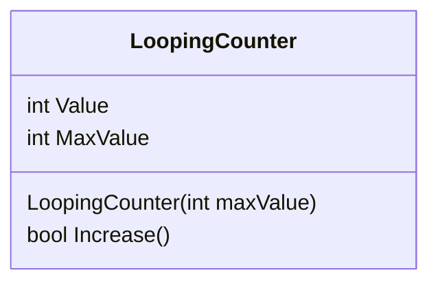
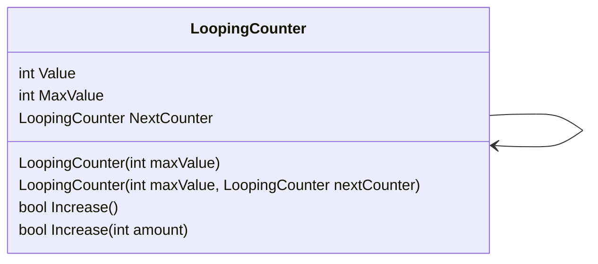

# Bounded Counter

Soms komen we tellers tegen die 'loopen', zoals de seconden, minuten en uren op een klok, of het aantal graden in een een hoek. We gaan voor dit voorbeeld een klok uitprogrammeren. Een klok heeft 3 waarden, de seconden, minuten en uren. Als de seconden groter zijn dan 59, gaat de waarde van de teller weer terug naar 0, en gaat 'de volgende' teller (de minuten). Als deze te groot word, word de volgende teller (uren) opgehoogt. Het klassediagram voor deze klasse is erg simpel



## De klasse LoopingCounter

Maak de klasse `LoopingCounter`. Deze klasse houd 1 waarde bij (seconden, minuten of uren), en houd daarnaast een maximale waarde bij. Dit worden dus 2 velden. Zorg dat de klasse een constructor heeft waarmee de maximale waarde meegegeven kan worden, en dat deze in het veld opgeslagen is. De voorbeeldcode gebruikt de naam `Value` voor de property voor de huidige waarde

## De increase methode

Voeg een methode toe `bool Increase()`, die de waarde met 1 ophoogt. Als de waarde groter of gelijk is dan de maximale waarde, reset 'm dan weer naar 0. Als de waarde is reset, geeft de methode true terug, als de waarde niet is gereset geeft de methode false terug. Hierdoor kunnen we hierna de objecten 'aan elkaar' koppelen

## Program

We kunnen nu onze klasse gaan gebruiken. Zet in `Program.cs` de volgende code om de teller te testen
```cs
LoopingCounter hours = new LoopingCounter(24);
for(int i = 0; i < 50; i++)
{
    hours.Increase();
    Console.WriteLine($"Hours: {hours.Value}");
}
```
Deze code zal 50 keer de increase methode aanroepen, en daarna de waarde afdrukken. Dit is de basis voor de teller

Voeg nu code toe voor de minuten en seconden, waarbij de increase van de minuten aangeroepen wordt zodra de seconden gereset worden 

> Tip: je zult moeten kijken wat de `Increase()`methode teruggeeft, en daarmee verdere tellers moeten verhogen

> Tip: Je kunt met `Console.WriteLine($"{hours.Value:00}:{minutes.Value:00}:{seconds.Value:00}");` de cijfers afdrukken met een 0 ervoor als dat nodig is


## Extra uitbereiding (optioneel)
We kunnen de counter uitbreiden om automatisch de volgende teller ook op te hogen, door een verwijzing mee te geven naar de volgende counter

- Maak een extra property `nextCounter` in de klasse aan die de volgende teller opslaat. De seconden slaan dan de minuten op, de minuten slaan de uren op, en de uren slaan niets op (null). Verander de increase methode zodat deze automatisch de increase methode van de volgende teller aanroept als de teller gereset word
- Maak een extra methode `Increase(int amount)`, die in 1 keer de teller ophoogt met een aantal seconden (dus niet de andere increase methode aanroepen met een lusje). Je zult dus moeten berekenen hoeveel seconden de volgende teller opgehoogt moet worden

Het klassediagram is met de uitbereidingen


In het Program.cs zou je dit nu moeten kunnen testen met de code
```csharp
LoopingCounter hours = new LoopingCounter(24);
LoopingCounter minutes = new LoopingCounter(60, hours);
LoopingCounter seconds = new LoopingCounter(60, minutes);

for(int i = 0; i < 100000; i++)
{
    Console.WriteLine($"{hours.Value:00}:{minutes.Value:00}:{seconds.Value:00}");
    seconds.Increase();
}

for(int i = 0; i < 100; i++)
{
    Console.WriteLine($"{hours.Value:00}:{minutes.Value:00}:{seconds.Value:00}");
    seconds.Increase(100);
}
```