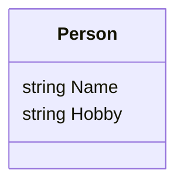

# Menu systeem voor dataopslag

We gaan in deze opdracht een simpel console-menusysteem maken om gegevens over hobbies op te slaan. We willen graag gegevens bijhouden van mensen, met hun favoriete hobby. Hiervoor willen we mensen kunnen toevoegen, opvragen welke mensen er ingevoerd zijn en een lijst van mensen kunnen printen met een bepaalde hobby. Een voorbeeld van de console-output en -input is bijvoorbeeld

```
Hobby Menu!

-*-*-*-*-*-*-*-*-*-*-*-*-*-*-*
| What would you like to do? |
-*-*-*-*-*-*-*-*-*-*-*-*-*-*-*

1) Add Person
2) Print all people
3) Search for hobby
x) Stop Application
1
Please input the person's name: Jan Jansen
Please input the person's hobby: Programmeren

-*-*-*-*-*-*-*-*-*-*-*-*-*-*-*
| What would you like to do? |
-*-*-*-*-*-*-*-*-*-*-*-*-*-*-*

1) Add Person
2) Print all people
3) Search for hobby
x) Stop Application
1
Please input the person's name: Sophie Bakker
Please input the person's hobby: Hardlopen

-*-*-*-*-*-*-*-*-*-*-*-*-*-*-*
| What would you like to do? |
-*-*-*-*-*-*-*-*-*-*-*-*-*-*-*

1) Add Person
2) Print all people
3) Search for hobby
x) Stop Application
1
Please input the person's name: Noah Smit
Please input the person's hobby: Programmeren

-*-*-*-*-*-*-*-*-*-*-*-*-*-*-*
| What would you like to do? |
-*-*-*-*-*-*-*-*-*-*-*-*-*-*-*

1) Add Person
2) Print all people
3) Search for hobby
x) Stop Application
1
Please input the person's name: Finn Kuiper
Please input the person's hobby: Fietsen

-*-*-*-*-*-*-*-*-*-*-*-*-*-*-*
| What would you like to do? |
-*-*-*-*-*-*-*-*-*-*-*-*-*-*-*

1) Add Person
2) Print all people
3) Search for hobby
x) Stop Application
1
Please input the person's name: Sara Mulder
Please input the person's hobby: Fietsen

-*-*-*-*-*-*-*-*-*-*-*-*-*-*-*
| What would you like to do? |
-*-*-*-*-*-*-*-*-*-*-*-*-*-*-*

1) Add Person
2) Print all people
3) Search for hobby
x) Stop Application
2
Jan Jansen with hobby Programmeren
Sophie Bakker with hobby Hardlopen
Noah Smit with hobby Programmeren
Finn Kuiper with hobby Fietsen
Sara Mulder with hobby Fietsen

-*-*-*-*-*-*-*-*-*-*-*-*-*-*-*
| What would you like to do? |
-*-*-*-*-*-*-*-*-*-*-*-*-*-*-*

1) Add Person
2) Print all people
3) Search for hobby
x) Stop Application
3
Please input hobby: Programmeren
Jan Jansen
Noah Smit

-*-*-*-*-*-*-*-*-*-*-*-*-*-*-*
| What would you like to do? |
-*-*-*-*-*-*-*-*-*-*-*-*-*-*-*

1) Add Person
2) Print all people
3) Search for hobby
x) Stop Application
```

## Class `Person`

Om deze gegevens op te slaan maken we eerst een klasse `Person`, om deze gegevens op te slaan. Deze klasse is erg simpel, deze opdracht gaat over het gebruiken van data in de klasse, en minder om het ontwerpen en functionaliteiten binnen deze klasse



## Program.cs, het hoofdmenu

Allereerst moeten we onze data natuurlijk opslaan. Dit kunnen we doen in een `List<Person> People`. Daarna kunnen we het menu laten zien. Dit menu blijft getoond worden, totdat de applicatie met een `x` afgesloten word. Je kunt dit doen door het menu in een `while(true)` lus te zetten

Het menu begint met een header, deze kun je uitprinten met een `Console.WriteLine()`

```
-*-*-*-*-*-*-*-*-*-*-*-*-*-*-*
| What would you like to do? |
-*-*-*-*-*-*-*-*-*-*-*-*-*-*-*

1) Add Person
2) Print all people
3) Search for hobby
x) Stop Application
```

Hierna vraagt de applicatie om invoer. Deze invoer kun je met de `Console.ReadLine()` methode opvragen. Op basis hiervan kunnen we een if-structuur maken die de input afhandelt. Als een `x` ingevoerd is, stopt de applicatie

Implementeer de basis-structuur voor dit menu
 - Maak de lijst `people`
 - De while lus
 - Het printen van het menu
 - Het vragen om input
 - De if-boom (of switch case) om de verschillende opties af te handelen. Gebruik om af te sluiten het `break` commando om uit de `while(true)`-lus te breken


## Add Person
Vul de code in om een persoon toe te voegen. Vraag de gebruiker om input (in het voorbeeld is `Console.Write` gebruikt ipv `Console.WriteLine`, maak een nieuw `Person`-object aan, en sla deze op in de lijst van `people` die je eerder hebt aangemaakt)

## Print Person
Vul de code in om alle personen af te drukken in de console. Je kunt hier de `ToString` methode voor toevoegen aan de `Person` klasse om je code in het menu te versimpelen

## Search for hobby
Vul de code in om alle personen af te drukken die een bepaalde hobby hebben. Vraag eerst de gebruiker om de hobby, en filter hierna alle mensen met die hobby


## Testen

Test je programma en kijk of je dezelfde output kunt krijgen als in het voorbeeld bovenin