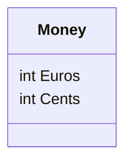

# Geld

In eerdere opdrachten hebben we geldbedragen opgeslagen met behulp van een `double`-variabele. In werkelijkheid moet geld niet worden weergegeven als een `double`, omdat de rekenkundige nauwkeurigheid van `double` niet betrouwbaar is (zie ook [microsoft](https://learn.microsoft.com/en-us/cpp/build/why-floating-point-numbers-may-lose-precision)). Hierom word er in C# een speciaal datatype gebruikt, de `decimal`. Een ander idee zou zijn om een klasse te implementeren die geld vertegenwoordigt. We beginnen met het volgende klassenraamwerk:



```csharp
public class Money
{
    public int Euros { get; set; }
    public int Cents { get; set; }
    
    public Money(int euros, int cents)
    {
        this.Euros = euros;
        this.Cents = cents;
    }
}
```

## Opdracht 1: ToString

Implementeer de `ToString` methode in de `Money` klasse, zodat het bedrag in euros en centen word weergegeven

```csharp
Money a = new Money(10, 0);
Money b = new Money(5, 50);
Money c = new Money(0, 5);

Console.WriteLine(a);  // € 10.00e
Console.WriteLine(b);  // € 5.50e
Console.WriteLine(c);  // € 0.05e
```

## Opdracht 2: Plus

Implementeer de methode `public Money Plus(Money added)`, die een nieuw object `Money` retourneert met een waarde die gelijk is aan de som van het object waarvoor de methode werd aangeroepen en het object dat als parameter werd doorgegeven.

Voorbeelden van methodegebruik:

```csharp
Money a = new Money(10, 0);
Money b = new Money(5, 0);

Money c = a.Plus(b);

Console.WriteLine(a);  // 10.00e
Console.WriteLine(b);  // 5.00e
Console.WriteLine(c);  // 15.00e

a = a.Plus(c); 

Console.WriteLine(a);  // 25.00e
Console.WriteLine(b);  // 5.00e
Console.WriteLine(c);  // 15.00e
```

## Opdracht 3: Less

Creëer de methode `public bool Less(Money compared)`, die `true` retourneert als het object waarvoor de methode werd aangeroepen minder waardevol is dan het object dat als parameter werd doorgegeven.

```csharp
Money a = new Money(10, 0);
Money b = new Money(3, 0);
Money c = new Money(5, 0);

Console.WriteLine(a.Less(b));  // false
Console.WriteLine(b.Less(c));  // true
```

## Opdracht 4: Minus

Maak tot slot de methode `public Money Minus(Money decremented)`, die een nieuw object `Money` retourneert met een waarde die gelijk is aan het object waarvoor de methode werd aangeroepen minus het object dat als parameter werd doorgegeven. Als de waarde negatief zou worden, moet het resulterende `Money`-object de waarde 0 hebben.

Voorbeelden van methodegebruik:

```csharp
Money a = new Money(10, 0);
Money b = new Money(3, 50);

Money c = a.Minus(b);

Console.WriteLine(a);  // 10.00e
Console.WriteLine(b);  // 3.50e
Console.WriteLine(c);  // 6.50e

c = c.Minus(a);  

Console.WriteLine(a);  // 10.00e
Console.WriteLine(b);  // 3.50e
Console.WriteLine(c);  // 0.00e
```