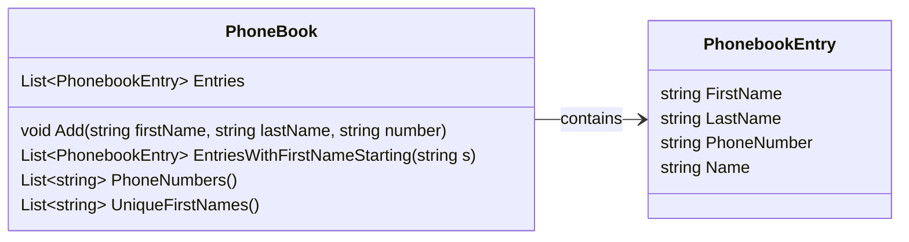

# Telefoonboek

In deze opdracht gaan we een simpel telefoonboek schrijven, met een aantal functionaliteiten om hier dingen in op te zoeken. Dit gaan we doen volgens het volgende ontwerp


Dit doen we natuurlijk stap voor stap


## De klasse `PhoneBookEntry`

Om gegevens in ons telefoonboek op te slaan, moeten we wat data bij elkaar opslaan, dit doen we met de properties zoals in het klassediagram. Let hierbij op, de `Name` property is hierbij niet een automatisch gegenereerde property, maar geeft de voornaam, een spatie en een achternaam terug. Maak deze klasse. Ga voor jezelf na, is string het beste type voor het `PhoneNumber` veld?

## De klasse `PhoneBook`

Maak de klasse `PhoneBook` met de property om de Entries in op te slaan, en maak de Add methode. Je kunt de volgende code gebruiken om dit te testen

```csharp
PhoneBook phoneBook = new();

phoneBook.Add("Jan", "Jansen", "0612345678");
phoneBook.Add("Piet", "Pietersen", "0687654321");
phoneBook.Add("Klaas", "Klaassen", "0623456789");
phoneBook.Add("Anna", "De Vries", "0645678912");
phoneBook.Add("Sophie", "Bakker", "0611223344");
phoneBook.Add("Anna", "Van Dijk", "0678901234");
phoneBook.Add("Emma", "Hendriks", "0654321987");
phoneBook.Add("Finn", "Kuiper", "0612347890");
phoneBook.Add("Noah", "Visser", "0623456712");
phoneBook.Add("Liam", "Smit", "0634567891");
```

## De methode `PhoneNumber`

Voeg in de de `PhoneBook` klasse de methode `public string PhoneNumber(string name)` toe. Deze methode zoekt de entry op met de juiste naam (volledige naam), en geeft het telefoonnummer van deze persoon terug. Als de persoon niet gevonden kan worden, geeft de methode een lege string terug

Een voorbeeld

```csharp
Console.WriteLine(phoneBook.PhoneNumber("Klaas Klaassen")); // 0623456789
Console.WriteLine(phoneBook.PhoneNumber("Noah Visser")); // 0623456712
Console.WriteLine(phoneBook.PhoneNumber("Piet Puk")); // 
```

## De methode `PhoneNumbers`

Voeg in de `PhoneBook` klasse de methode `public List<string> PhoneNumbers()` toe. Deze methode geeft een lijst met alle telefoonnummers terug

```csharp
Console.WriteLine("Phone numbers: " + string.Join(", ", phoneBook.PhoneNumbers()));
//Phone numbers: 0612345678, 0687654321, 0623456789, 0645678912, 0611223344, 0678901234, 0654321987, 0612347890, 0623456712, 0634567891
```

## De methode `UniqueFirstNames`

Voeg in de `PhoneBook` klasse de methode `public List<string> UniqueFirstNames()` toe. Deze methode geeft een lijst met alle voornamen terug, maar zonder dubbelen

```csharp
Console.WriteLine("First Names: " + string.Join(", ", phoneBook.UniqueFirstNames()));
//First Names: Jan, Piet, Klaas, Anna, Sophie, Emma, Finn, Noah, Liam
```

## De methode `EntriesWithFirstNameStarting`
Voeg in de `PhoneBook` klasse de methode `public List<PhonebookEntry> EntriesWithFirstNameStarting(string s)` toe. Deze methode geeft een lijst van alle phonebook entries terug, waarbij de voornaam begint met een meegegeven letter

```csharp
var entries = phoneBook.EntriesWithFirstNameStarting("J");
foreach(var entry in entries)
{
    Console.WriteLine(entry.Name);
}
//Jan
```