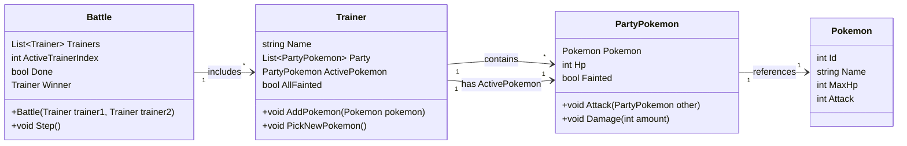

# Pokemon Battle

We gaan een systeem ontwikkelen om (sterk versimpelde) pokemon-battles te simuleren. Een pokemon battle is een spel waarbij 2 trainers proberen elkaar te verslaan met een team van pokemons. Een pokemon heeft vooor ons een aantal hitpoints (HP), en een aanvalskracht (in de echte game zitten daar nog een heleboel andere eigenschappen bij). De pokemon kunnen meerdere keren voorkomen in een team, maar we willen eigenlijk de lijst van pokemon maar 1 keer definieren. Hierom maken we een spliting tussen een `Pokemon` (voor de kenners, de pokemon in de pokedex met alle algemene informatie die gedeeld zijn), en een `PartyPokemon`, de daadwerkelijke pokemon die in de party zit, met een MaxHP. Dit kunnen we modelleren in het volgende UML-diagram



Uiteindelijk is de bedoeling dat we de code kunnen testen met de volgende testcode.

```csharp
List<Pokemon> pokedex = [
    new Pokemon { Id = 1, Name = "Pikachoo", MaxHp = 100, Attack = 50 },
    new Pokemon { Id = 2, Name = "Charflame", MaxHp = 90, Attack = 55 },
    new Pokemon { Id = 3, Name = "Bulbataur", MaxHp = 95, Attack = 45 },
    new Pokemon { Id = 4, Name = "Squirry", MaxHp = 85, Attack = 40 },
    new Pokemon { Id = 5, Name = "Jigglipop", MaxHp = 110, Attack = 30 },
    new Pokemon { Id = 6, Name = "Meowthar", MaxHp = 80, Attack = 35 },
    new Pokemon { Id = 7, Name = "Psydock", MaxHp = 90, Attack = 40 },
    new Pokemon { Id = 8, Name = "Machump", MaxHp = 100, Attack = 60 },
    new Pokemon { Id = 9, Name = "Gengrim", MaxHp = 105, Attack = 70 },
    new Pokemon { Id = 10, Name = "Snorlox", MaxHp = 160, Attack = 65 },
    new Pokemon { Id = 11, Name = "Eevola", MaxHp = 85, Attack = 50 },
    new Pokemon { Id = 12, Name = "Mewtan", MaxHp = 150, Attack = 90 },
    new Pokemon { Id = 13, Name = "Moltira", MaxHp = 120, Attack = 85 },
    new Pokemon { Id = 14, Name = "Zaprus", MaxHp = 120, Attack = 85 },
    new Pokemon { Id = 15, Name = "Artican", MaxHp = 120, Attack = 85 },
];

// maak de trainers aan en geef ze ieder 3 willekeurige pokemon
var trainer1 = new Trainer() { Name = "Ashen Catcher" };
for (int i = 0; i < 3; i++)
{
    trainer1.AddPokemon(pokedex[Random.Shared.Next(pokedex.Count)]);
}
var trainer2 = new Trainer() { Name = "Josie and Jace" };
for (int i = 0; i < 3; i++)
{
    trainer2.AddPokemon(pokedex[Random.Shared.Next(pokedex.Count)]);
}

//we maken de battle aan en simuleren totdat de battle klaar is
Battle battle = new Battle(trainer1, trainer2);
while(!battle.Done)
{
    battle.Step();
}

//en dan is er een winnaar
Console.WriteLine("The battle is over!");
Console.WriteLine($"{battle.Winner.Name} has won!");
```

## De klasse `Pokemon`

We beginnen met de klasse `Pokemon`. Deze heeft eigenlijk geen bijzondere eigenschappen, alleen de 4 properties zoals in het klassediagram. Implementeer deze klasse, en de pokedex in de main zou gevuld moeten kunnen worden

## De klasse PartyPokemon

Hierna kunnen we de klasse `PartyPokemon` maken. Dit is een pokemon die in de party van een trainer zit, en heeft dus een aantal HP, kan aanvallen en aangevallen worden. Maak klasse `PartyPokemon` en geef deze de property `Pokemon` en `Hp`. `Fainted` is een bool-property die true geeft als `Hp` gelijk is aan 0, en false als `Hp` niet gelijk is aan 0.

Maak ook de methoden `Attack` en `Damage`, maar zet hier nog geen code in

## De klasse Trainer

We maken nu eerst het raamwerk voor de `Trainer` klasse. Geef deze klasse de 3 properties `Name`, `Party` en `ActivePokemon`. De `AllFainted` is weer een property met eigen code, die true teruggeeft als alle pokemon in de party `Fainted` op true hebben.

Maak ook de methoden `Addpokemon` en `PickNewPokemon`, maar zet hier nog geen code in

## De klasse Battle

We maken nu het raamwerk voor de `Battle` klasse. In een battle zijn 2 trainers, die om de beurt aan de beurt zijn. Eerst is trainer1 aan de beurt, dan trainer2, dan trainer1, dan trainer2, enzovoorts. We kunnen deze 2 trainers als 2 losse properties opslaan, maar dat geeft kans op veel dubbele code. In plaats daarvan houden we de trainers bij in een lijst van trainers (een lijst met 2 elementen), en we houden de actieve trainer bij in een integer, `ActiveTrainerIndex`. Als deze 0 is, is trainer1 aan de beurt, als deze 1 is, is trainer2 aan de beurt

`Winner` is een property met code. Als trainer1 geen pokemon meer heeft die niet fainted zijn, heeft trainer2 gewonnen, en andersom, als trainer2 geen pokemon meer heeft die niet fainted zijn, heeft trainer1 gewonnen. Als dit allebei niet het geval is, geeft deze property  `null` terug.

`Done` is weer een property met code, deze geeft true terug zodra de winner niet `null` is

Daarnaast hebben we de constructor die de 2 trainers in de lijst zet, en de `Step` methode. Implementeer alle properties en de constructor, maak de step methode, maar laat de code hiervan nog leeg.

Als je het programma nu uitvoert, zou het programma niets moeten doen en oneindig moeten doorlopen, omdat de methoden nog geen acties bevatten om het gevecht tot een einde te brengen

## Initialisatie

Voordat er iets gesimuleerd kan worden, moeten beide trainers een pokemon kiezen om mee te beginnen. Dit doen ze met de `PickNewPokemon` methode in de `Trainer` klasse. Deze methode zet `ActivePokemon` op een willekeurige pokemon uit de `Party`-lijst, maar deze pokemon mag niet `Fainted` zijn. (Als er geen pokemon over zijn die niet fainted zijn, hoeft deze methode niets te doen). Nadat er een nieuwe pokemon gekozen is, print deze methode de tekst
`$"Player {Name} has pulled out {ActivePokemon.Pokemon.Name}"`

Roep deze methode uiteindelijk voor beide spelers aan in de constructor van `Battle`

## De Step methode

We beginnen met de step methode om de battle te gaan simuleren. Dit is de kern van het battle-systeem en word steeds aangeroepen om een speler 1 actie te laten uitvoeren. Na deze actie gaat de beurt naar de andere speler

- Allereerst, print deze methode `$"It's {currentTrainer}'s turn"`, waarbij currentTrainer de naam van de trainer is die nu aan de beurt is.
- Hierna roep je de `Attack` methode aan van de `CurrentPokemon` van de huidige trainer, met als parameter de `CurrentPokemon` van de andere trainer
- Als de andere pokemon nu fainted is, moet de andere trainer een nieuwe pokemon kiezen met de `PickNewPokemon` methode
- Als laatste moet de beurt naar de andere speler, door de `ActivePlayerIndex` van 0 naar 1 te zetten, of van 1 naar 0 te zetten.
  > Dit kun je makkelijk doen met de regel `ActivePlayerIndex = 1 - ActivePlayerIndex`

Dit is de basis voor de battle, de ene speler valt de andere speler aan, en de volgende keer wisselt dit om

## De overige methoden

Implementeer nu de volgende methoden:

- `Trainer.AddPokemon`: Deze methode voegt een nieuwe `PartyPokemon` toe. Zet de pokemon die als parameter meegegeven is in dit nieuwe object, en initialiseer de `Hp` van deze nieuwe `PartyPokemon` op de `MaxHP` van de pokemon in de parameter. Je kunt dit ook doen door een constructor toe te voegen aan de `PartyPokemon`-klasse
- `PartyPokemon.Damage`: Deze methode verlaagt de `Hp` met `Damage`. Als de `Hp`-waarde kleiner is dan 0, zet deze dan weer op 0
- `PartyPokemon.Attack`: Deze methode roept de damage methode aan van de andere pokemon, met de HP van de huidige pokemon. Print daarna de volgende output
    ```
    $"{Pokemon.Name} attacks {other.Pokemon.Name}. {other.Pokemon.Name} gets {Pokemon.Attack} damage, its health is now {other.Hp} / {other.Pokemon.MaxHp}"
    ```
    Als de andere pokemon hierna verslagen is (`Fainted`), geef dan ook de volgende tekst weer
    ```
    $"{other.Pokemon.Name} has fainted!"
    ```

## Resultaat

Als het goed is, en je voert de applicatie nu uit, krijg je een battle tussen 2 trainers met 3 pokemon. Je kunt een output verwachten zoals

```
Player Ashen Catcher has pulled out Jigglipop
Player Josie and Jace has pulled out Meowthar
It's Ashen Catcher's turn
Jigglipop attacks Meowthar. Meowthar gets 30 damage, its health is now 50 / 80
It's Josie and Jace's turn
Meowthar attacks Jigglipop. Jigglipop gets 35 damage, its health is now 75 / 110
It's Ashen Catcher's turn
Jigglipop attacks Meowthar. Meowthar gets 30 damage, its health is now 20 / 80
It's Josie and Jace's turn
Meowthar attacks Jigglipop. Jigglipop gets 35 damage, its health is now 40 / 110
It's Ashen Catcher's turn
Jigglipop attacks Meowthar. Meowthar gets 30 damage, its health is now 0 / 80
Meowthar has fainted!
Player Josie and Jace has pulled out Squirry
It's Josie and Jace's turn
Squirry attacks Jigglipop. Jigglipop gets 40 damage, its health is now 0 / 110
Jigglipop has fainted!
Player Ashen Catcher has pulled out Machump
It's Ashen Catcher's turn
Machump attacks Squirry. Squirry gets 60 damage, its health is now 25 / 85
It's Josie and Jace's turn
Squirry attacks Machump. Machump gets 40 damage, its health is now 60 / 100
It's Ashen Catcher's turn
Machump attacks Squirry. Squirry gets 60 damage, its health is now 0 / 85
Squirry has fainted!
Player Josie and Jace has pulled out Gengrim
It's Josie and Jace's turn
Gengrim attacks Machump. Machump gets 70 damage, its health is now 0 / 100
Machump has fainted!
Player Ashen Catcher has pulled out Psydock
It's Ashen Catcher's turn
Psydock attacks Gengrim. Gengrim gets 40 damage, its health is now 65 / 105
It's Josie and Jace's turn
Gengrim attacks Psydock. Psydock gets 70 damage, its health is now 20 / 90
It's Ashen Catcher's turn
Psydock attacks Gengrim. Gengrim gets 40 damage, its health is now 25 / 105
It's Josie and Jace's turn
Gengrim attacks Psydock. Psydock gets 70 damage, its health is now 0 / 90
Psydock has fainted!
The battle is over!
Josie and Jace has won!
```
