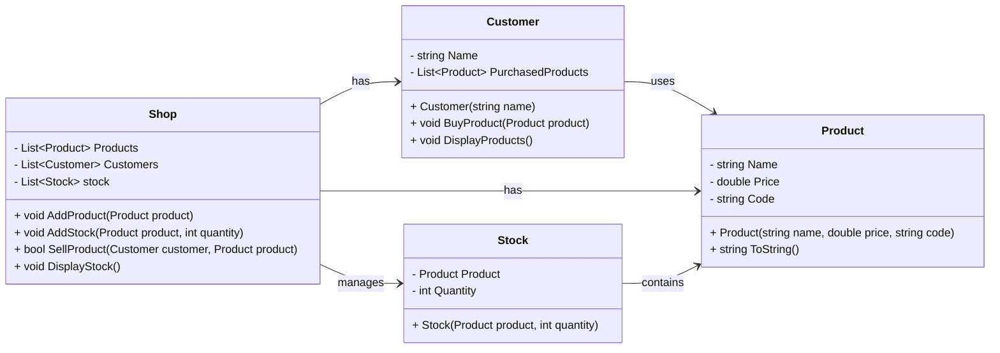

# Winkelvoorraad en klanten

We gaan een systeem maken om de voorraad in een winkel bij te houden, waarbij klanten producten kunnen kopen. Dit gaan we volgens het volgende ontwerp doen



Hierbij is de winkel het centrale object, dat de voorraad van producten bijhoud. Wat hierbij opvalt is er een losse klasse, `Stock` nodig is om op te slaan hoeveel van ieder product er beschikbaar is

## De klasse `Product`

Om te beginnen met programmeren, is het 't makkelijkst om te beginnen met een klasse met weinig afhankelijkheden, zoals de kalsse `Product`. Daarna kunnen de klassen gemaakt worden die afhangen van `Product`, zoals `Customer` of `Stock`

Maak de klasse `Product`. Deze klasse heeft geen bijzondere functionaliteit die beschreven hoeft te worden. De ToString geeft de naam, prijs en code van het product

## De klasse `Customer`

Maak de klasse `Customer`, zoals in het klassediagram staat beschreven. Maak de 2 properties van de klasse, en zorg dat de lijst met een nieuwe lijst word geïnitialiseerd. Je kunt de 2 methoden ook al aanmaken, maar laat de code hiervan nog leeg.

## De klasse `Stock`

De klasse `Stock` is wederom een vrij kale klasse, met vooral data. Implementeer deze volgens het klassediagram

## De klasse `Shop`

We kunnen nu eindelijk gaan beginnen aan de klasse `Shop`. Maak de klasset met de properties, initialiseer de properties, en maak de methoden. De code van de methoden kun je nog leeg laten.

## Testen

We kunnen nu een stukje code op gaan zetten om de code te testen. Deze code roept de verschillende methoden aan, en zal nu dus nog niet werken. Door de methoden langzaam in te vullen, zal de applicatie steeds meer functionaliteiten krijgen

Zet de volgende code in je `Program.cs`, en voer deze uit.
```csharp
// Create store, products, and customers
Shop shop = new Shop();

Product laptop = new Product("Laptop", 999.99, "P001");
Product phone = new Product("Smartphone", 499.99, "P002");
Product book = new Product("Book", 19.99, "P003");

// Add products to the store
shop.AddProduct(laptop);
shop.AddProduct(phone);
shop.AddProduct(book);

// Add stock to the store
shop.AddStock(laptop, 5);
shop.AddStock(phone, 10);
shop.AddStock(book, 20);

// Create customers
Customer customer1 = new Customer("John");
Customer customer2 = new Customer("Sophie");

// Sell products to customers
shop.SellProduct(customer1, laptop);
shop.SellProduct(customer2, phone);
shop.SellProduct(customer1, book);

Console.WriteLine("Left in store:");
// Display current stock
shop.DisplayStock();

customer1.DisplayProducts();
```

Uiteindelijk zou de applicatie de volgende code moeten geven

```
Laptop (P001) - €999.99 has been added to the shop
Smartphone (P002) - €499.99 has been added to the shop
Book (P003) - €19.99 has been added to the shop
John now has a Laptop
John has bought Laptop.
Sophie now has a Smartphone
Sophie has bought Smartphone.
John now has a Book
John has bought Book.
Left in store:
   4x Laptop (P001) - €999.99
   9x Smartphone (P002) - €499.99
  19x Book (P003) - €19.99
John now has the following products:
 - Laptop
 - Book
```

## Shop.AddProduct methode

Als eerste staat in de testcode een AddProduct methode. Deze methode voegt het meegegeven product toe aan de winkel en geeft de tekst
```
{product} has been added to the shop
```

Als je het programma nu uitvoert, zou je de eerste 3 regels aan input moeten zien

## Shop.AddStock methode

Maak hierna de AddStock methode. Deze methode is wat complexer.

Als er nog geen stock is van het product, moet er een nieuw stock object aangemaakt worden en deze moet opgeslagen worden
Als er al wel een stock is van het product, kun je deze stock ophalen uit de lijst en het aantal hierin ophogen

De standaard programmacode bovenin test dit niet volledig, maar je kunt dit testen door eenzelfde product meerdere malen toe te voegen

```csharp
shop.AddStock(laptop, 1);
shop.AddStock(laptop, 2);
shop.AddStock(laptop, 3);
```

De winkel zou uiteindelijk maar 1 stock-object in de lijst met stock moeten hebben na deze code

## Shop.SellProduct

Maak nu de `Shop.SellProduct` methode. Deze methode kijkt eerst of het product op voorraad is. Als het product niet op voorraad is, schrijf je de tekst
```
{product} is not available
```
in de console, en geeft de methode false terug. Als het product wel op voorraad is
- maak je de voorraad 1 minder
- roep je de `BuyProduct` methode aan op de koper zodat de klant ook het product heeft
- print je de tekst
```
{customer.Name} has bought {product.Name}.
```
- return je true

Implementeer ook de `Customer.BuyProduct` methode. Deze voegt het product toe aan de lijst met gekochte producten, en print je
```
{Name} now has a {product.Name}"
```

## Shop.DisplayStock

Uiteindelijk wil de winkel graag weten wat er na alle transacties nog in de winkel beschikbaar is. We maken hiervoor de `Shop.DisplayStock` methode, die de huidige voorraad van de winkel laat zien. Implementeer deze methode en laat 'm op losse regels de voorraad printen. In het voorbeeld is de hoeveelheid van de voorraad rechts uitgelijnd, dit is optioneel.

## Customer.DisplayProducts

Als laatste willen we nu weten welke producten een klant heeft. Dit kunnen we doen met de methode `Customer.DisplayProducts`. Deze methode laat alle producten zien die een klant heeft gekocht, onder elkaar met een -streepje voor ieder product.